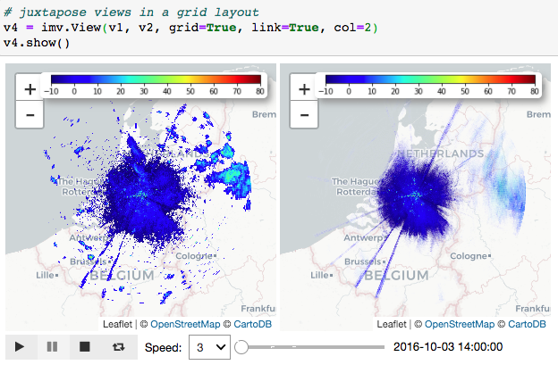

# ipymeteovis

A Jupyter-based toolkit for visualizing meteorological and ecological data.

## Usage

### Make tempset

Tempset (temporary set) is the intermediate result of processing input data
 before visualization.  Note that files under the input path must have the
 same schema. For example, in case of radar data, this means data from the
  same radar.
 

### List existing tempsets

Meta information of existing tempsets are presented. Multi-select
 tempsets to remove.

### Animation

More than one data files with timestamps as input will result in an animation
. Otherwise, static plot.

### Average view   

If having time series as input and set `avg=True`, the result will be an average
 view. 

### Overlay

To overlay multiple views together, simply put more IDs as input. Existing view
 instances can also be the input instead of IDs. 

### Multiple views in grid layout

To show multiple views in grid layout, set `grid=True`. `col` indicates the
 number of columns in the grid. `link=True` links all the sub-maps on map center and zoom level. 

## Installation

### 1. Install anaconda

It’s highly recommended to work with ipymeteovis in anaconda environments. To install the latest version of anaconda, refer to

https://docs.conda.io/projects/conda/en/latest/user-guide/install/index.html 

where you can also find useful information about anaconda.

### 2. Download ipymeteovis

Clone the repository to your local machine:

    git clone https://gitlab.com/BerendWijers/meteo_vis.git
    
You may need your gitlab account and password for doing this. 

### 3. Prepare anaconda environment

Go to the folder you just cloned, create a new anaconda environment:

    conda create -n <yourenvname> --file spec-file.txt
    
Replace \<yourenvname\> with the name of your own environment. After finished, activate the environment you just created:

    conda activate <yourenvname>

You also need to enable *ipyleaflet* in your environment:

    jupyter nbextension enable --py --sys-prefix ipyleaflet
    
### 4. Start working
    
Now, you can run Jupyter and create your own notebook:

    jupyter notebook